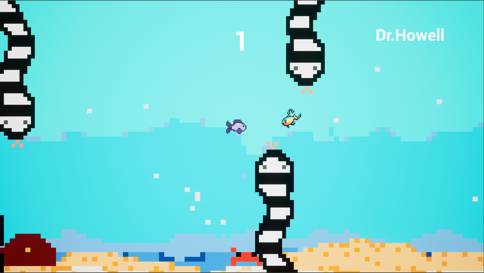

# GameCentralCS

Status: Completed archive project

I built GameCentralCS as a Firebase-hosted collection of Unreal Engine HTML5 game experiments, including Flappy Fish with custom assets and a scoring overlay.

## Overview

I built the games in Unreal Engine 4.24.3 and exported them for HTML5 hosting. Because official HTML5 export support was removed after this Unreal Engine version, the project required older tooling and community-supported deployment notes.

## Flappy Fish

Flappy Fish started from a tutorial-style Flappy Bird clone and grew into my own custom version with original pixel-art assets, scoring overlay, and gameplay logic in Unreal Blueprint.

## Tools

- Unreal Engine 4.24.3
- Unreal Blueprint
- HTML5 export workflow
- Firebase Hosting

## Status Notes

I keep this as an archive project. It shows early game development, web hosting, and deployment experimentation, but it should remain secondary to my current engineering direction.

## Portfolio

Portfolio page: [GameCentralCS](https://wchowellarchive.web.app/Projects/GameCentralCS/gamecentralcs.html)

Live site: [gamecentralcs.web.app](https://gamecentralcs.web.app/gamecentral.html)
